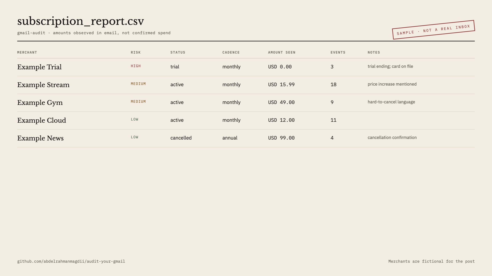

# Audit Your Gmail

[](https://github.com/abdelrahmanmagdii/audit-your-gmail/actions/workflows/ci.yml)

Local subscription auditor for Gmail. It searches recent mail for recurring-billing language, screens sender/subject/snippet with a **small local model**, then runs a **larger local model** only on the hits.

Works on **macOS, Windows, and Linux**. Default inference is [Ollama](https://ollama.com). Apple Silicon can optionally use MLX for Stage 1.

Email bodies are never sent to a remote LLM API. Gmail is used only to fetch your mail.

State lives in `~/.gmail-audit/` (Windows: `%APPDATA%\gmail-audit`). You can run the command from any directory.



## Quick start

With [uv](https://docs.astral.sh/uv/):

```bash
uvx --from git+https://github.com/abdelrahmanmagdii/audit-your-gmail.git gmail-audit setup
uvx --from git+https://github.com/abdelrahmanmagdii/audit-your-gmail.git gmail-audit run
```

Or a local clone:

```bash
python3 -m venv .venv
source .venv/bin/activate          # Windows: .venv\Scripts\activate
pip install -e .
gmail-audit setup
gmail-audit run                    # first try: 200 most recent matches
gmail-audit run --all              # rest of the inbox (resumes)
gmail-audit report                 # reprint CSVs without calling Gmail
```

`setup` detects RAM/OS/GPU, starts Ollama if needed, pulls models, and imports a Desktop OAuth JSON from Downloads. `run` resumes from SQLite if you stop it (Ctrl+C is safe).

```bash
gmail-audit doctor                 # what is missing?
gmail-audit setup --yes            # pull models without a prompt
gmail-audit run --limit 50         # even shorter trial
gmail-audit report --open          # open the merchant CSV
gmail-audit run --backend mlx      # Apple Silicon only
gmail-audit purge                  # delete token, credentials, DB, CSVs
```

Apple Silicon extra (optional faster Stage 1):

```bash
pip install -e ".[apple]"
gmail-audit setup --backend mlx
```

## Gmail API credentials

You create your own Desktop OAuth client. This repo cannot ship a shared Gmail login: `gmail.readonly` is a [restricted Google scope](https://developers.google.com/workspace/gmail/api/auth/scopes).

**Walkthrough:** [docs/setup-gmail.md](docs/setup-gmail.md)

Short version:

1. [Google Cloud Console](https://console.cloud.google.com/) → new project
2. Enable the **Gmail API**
3. OAuth consent: **External**, stay in **Testing**, add **yourself** as a test user, add scope `gmail.readonly`
4. OAuth client ID → **Desktop app** → Download JSON
5. Leave the file in Downloads (name like `client_secret_….json`). `gmail-audit setup` copies it into `~/.gmail-audit/credentials.json`

The first browser sign-in shows **“Google hasn’t verified this app”**. That is expected. Advanced → Continue.

**Known tradeoff:** while the OAuth app stays in Testing (which it should — publishing triggers Google's verification process), Google expires the saved token after **7 days**. When that happens, `gmail-audit run` notices and reopens the browser sign-in automatically; you just click through again.

## How it picks models

| RAM | Stage 1 (screen) | Stage 2 (extract) |
|---|---|---|
| ~8 GB | `qwen2.5:1.5b` | same small model |
| ~16 GB | `qwen2.5:3b` | `qwen2.5:7b` |
| ~24–32 GB | `qwen2.5:3b` | `qwen3:8b` |
| 64 GB+ | `qwen2.5:7b` | `qwen2.5:14b` |

Only one stage is loaded at a time. Fanless laptops will still get warm on Stage 2; use a hard desk and plug in. CPU-only Windows/Linux works and is slow.

Ollama downloads are local model weights (a few GB). `setup` asks before pulling. If Ollama is installed but not running, setup/doctor/run try to start it.

## What it does

1. **Search** — Gmail query for subscription / renewal / trial / charge language (`newer_than:5y`). The built-in phrases are **English**; for inboxes in other languages, put a translated query under a `search_query` key in `config.json` (same Gmail query syntax).
2. **Stage 1** — classifies metadata only. High recall: uncertain screens are kept.
3. **Stage 2** — reads the body and extracts merchant, amount, cadence, risk, evidence **only** for interesting mail.

The first `run` with an empty database processes **200** most recent matches. Use `--all` for the rest; already-screened messages are skipped. Progress prints a rate and ETA.

## Outputs (in the data directory)

| File | Contents |
|---|---|
| `subscription_audit_v2.db` | Screened + analyzed rows |
| `subscription_report.csv` | Per-merchant summary (after Stage 2) |
| `subscription_timeline.csv` | Event timeline (after Stage 2) |
| `config.json` | Models chosen by `setup` |
| `credentials.json` / `token.json` | Your Gmail OAuth client |

Override the directory with `GMAIL_AUDIT_HOME`. `gmail-audit doctor` prints the path.

Fake sample (not a real inbox): [`examples/sample_subscription_report.csv`](examples/sample_subscription_report.csv).

Amounts are values **seen in email**, not confirmed spend. Reconcile against bank/card CSVs. `gmail-audit report` reprints the top merchants from SQLite without calling Gmail.

## Privacy

### Network calls this tool makes

The complete list — you can grep the code to confirm:

| Destination | When | What is sent |
|---|---|---|
| Google OAuth + Gmail API (TLS) | sign-in and `run` | OAuth credentials; read-only Gmail queries |
| Ollama (`localhost:11434`, or your `OLLAMA_HOST`) | Stage 1 & 2 | email metadata and flagged bodies, to **your own** Ollama server |
| `ollama.com` | `setup` model pulls | nothing personal — downloads weights |
| `huggingface.co` | only with the optional MLX backend | nothing personal — downloads weights |

No telemetry, no analytics, no crash reporting. Stage 1 fetches **metadata only** (`format=metadata`: subject, sender, date, snippet); full bodies are downloaded only for flagged mail, and only your local models ever see them.

- Gmail scope is read-only: `gmail.readonly`. It cannot send, delete, or change mail.
- Secrets, the database, and CSV reports stay in the data directory, readable only by your user account (`chmod 600`/`700` on macOS/Linux), and are gitignored if you clone.
- Point `OLLAMA_HOST` at a nonstandard port or another machine if that's where your Ollama runs — just know email content then goes to that host.

### Deleting everything

```bash
gmail-audit purge
```

deletes the token, OAuth client, database, and CSVs. Then revoke the app's access at [myaccount.google.com/permissions](https://myaccount.google.com/permissions), and `ollama rm <model>` if you no longer want the weights.

### Prompt injection

Email content is untrusted input fed to a local model, so a hostile email could at worst distort its own row in your local report (a wrong merchant name or risk label). It cannot exfiltrate anything: the models have no tools, no network access, and the output is only ever written to your local SQLite/CSVs.

## License

MIT. See [LICENSE](LICENSE).
